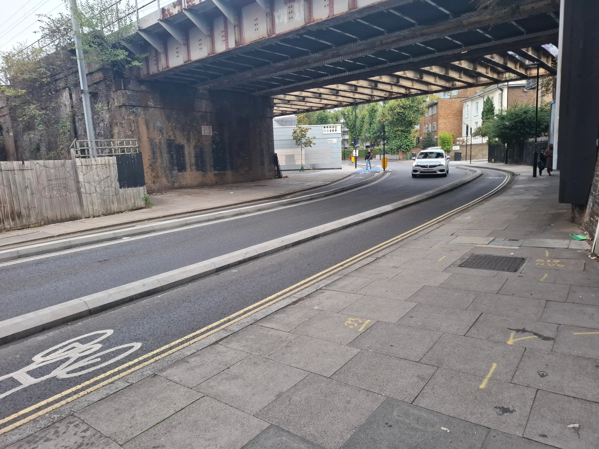

I started my day by *trying* to go to work. I got on my bike, had everything packed, helmet on, work bag attached to my bike. I made it to about 5 minutes from work and then did the dumbest thing. I have toe cages/clips on my pedals and usually I can just feel when the shoe is in the right spot. Today, I decided to look down to check. I decided to look down to check right as there was a bend coming up. I looked up just in time to see the barrier that separates the bike lane from the road get exponentially closer. It was one of those slow-motion moments. I had my hands on the brakes but the momentum of my heavily-packed bike had other ideas. The road wanted to curve, by bike wanted to go straight. 

So, over I went. I don't know the exact speed I was going but it was faster than the Lime bikes I left the light with and they top out at 15 mph. I also wasn't going full-sprint so it probably was just a little north of that. I didn't have a thought as I was going down, I was just watching it happen. I was just letting gravity and momentum do its thing. 

I knew I was going to have the standard palm and elbow injuries that come from these kinds of falls. I also found out when I got home that I had torn through my cycling jacket and had some road rash on my shoulder. Also some on my thigh. Also some on my shin and knee. 

I sat on the side of the road and called my wife. I wanted to tell her what happened and then figure out a plan of what to do next. I knew pretty much instantly that I couldn't continue on to work. As soon as I stood up, the post-adrenaline crash happened and I knew the only option was home. 

One observation: everyone on the road was really nice. I was at the front a pack of about 8 cyclists and of course my crash put a stop to their travel as well, but everyone made sure I was ok before continuing on. I had some other strangers check in as well as I was sitting there waiting for my ride. 

I'm bummed that I'm off the bike for a while especially as I had just recovered from an illness. I was really looking forward to these autumn rides. Hopefully the recovery is quick and I can get back at it.
